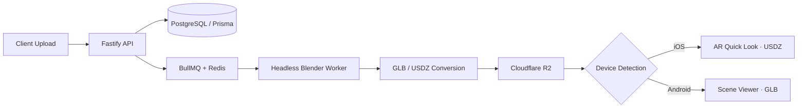

# Hi, I'm Nitin 👋

**Full-stack engineer who builds systems, not just screens.**

I work across the entire stack — React/Next.js frontends, Node.js/Fastify backends, async job pipelines, and the DevOps glue that keeps it all running. Most of my work lives in production: CRMs, project management platforms, and a WebAR product pipeline that converts and serves 3D models to mobile browsers.

---

## 🔭 What I'm building

### WebAR Product Viewer — "View in Your Room" for the web
A browser-based AR experience (no app install) that lets users place 3D products in their physical space.

**The interesting problems:**
- **Cross-platform AR handoff** — iOS and Android speak different AR formats (USDZ vs GLB). Built a hybrid detection + delivery layer so one upload serves both.
- **Isolated conversion workers** — Blender runs headless as a separate service behind a BullMQ queue, so a crashed 500MB model conversion never takes down the API.
- **LOD swapping over mesh streaming** — chose level-of-detail swaps for product-scale models; simpler, cacheable, and fast enough on 4G.

### Other production work
- **Creotek CRM** — full-stack CRM: backend APIs, React/Redux frontend, schema design, testing infrastructure
- **PMS** — project management platform; led backend architecture and code review for the team
- **Nexthouse / Sixth Sense** — [one-line description each — what problem, what you owned]

---

## 🧠 How I work

- I review PRs for a team and care about **clean architecture** — boundaries, dependency direction, and tests that actually catch regressions
- I'd rather understand a system deeply than collect surface-level tools — recent deep dives: database internals (ACID/CAP/BASE, MySQL vs PostgreSQL vs MongoDB tradeoffs), SSH tunneling for secure remote DB access
- Currently exploring **AI integration in web apps** — embedding LLM workflows into real products, not demos

---

## 🛠️ Stack

**Daily drivers:** TypeScript · Node.js · React/Next.js · PostgreSQL · Prisma · Redis/BullMQ · Docker
**Comfortable with:** MongoDB · MySQL · Fastify · Express · Tailwind · AWS · Cloudflare R2

---

## 📫 Reach me

[flawlessnitin.com](https://www.flawlessnitin.com) · [LinkedIn](#) · [Email](#)
